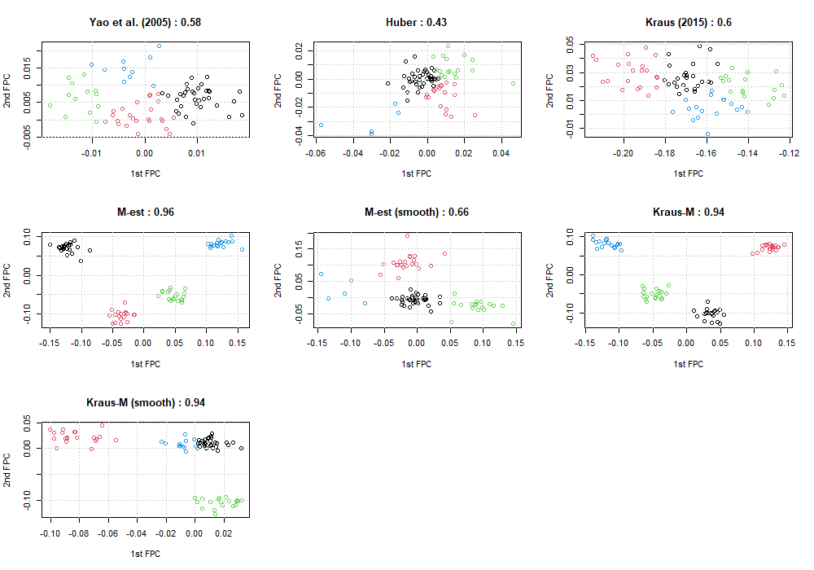

<style>
  p.caption {   <!-- figure caption -->
    font-size: 0.9em;
    font-style: italic;
    color: grey;
    <!-- margin-right: 10%; -->
    <!-- margin-left: 10%;   -->
    text-align: justify;
  }
  caption {    <!-- table caption -->
    font-size: 0.9em;
    font-style: italic;
    color: grey;
    <!-- margin-right: 10%; -->
    <!-- margin-left: 10%;   -->
    text-align: justify;
  }
</style>


```{r setup, include=FALSE}
library(knitr)
library(kableExtra)
library(tidyverse)
knitr::opts_chunk$set(
  echo = FALSE, message = FALSE, warning = FALSE, 
  # cache = T,
  fig.align = "center", fig.width = 12, fig.height = 6
)
# Set working directory
# knitr::opts_knit$set(root.dir = "../")
```


# Noise variance
- 코드에서 실수가 있었음 (average에서는 성립하지만, median에서는 성립하지 않음)
```{r}

```
- Estiamte이 크게 달라짐
  - 0.1 => 0.7
  - 0.03 => 0.5
- trimmed mean으로 사용하면 값이 줄어들긴 하지만 어느정도를 trim할지를 결정해야함


<br>

# AMI clustering
- 0이 많은 case를 강제로 추가하여 outlier로 생각하고 clustering
- 나머지 setting은 기존과 동일
- 결과는 좋지 않음... (0이 많은 case들이 전체적으로 값이 작은 curve들과 같은 그룹으로 묶임)


<br>


# M-estimator for partially observed functional data

## Marginal M-estimator for mean
> Park, Y., Chen, X., & Simpson, D. G. (2020). Robust M-estimation for Partially Observed Functional Data. arXiv preprint arXiv:2002.08560.

$$
\hat{\mu}^M(t) = \arg\min_{\theta} \sum_{i=1}^n O_i(t) \rho\left( X_i(t) - \theta \right)
$$

## Marginal M-estimator for covariance
- Kraus (2015)에서의 covariance 식을 M-estimator로 바꿔본 형태 (`MASS::huber()`)

$$
\hat{\sigma}^M(s,t) = \arg\min_{\theta} \sum_{i=1}^n U_i(s,t) \rho\left( \{X_i(s) - \hat{\mu}_{st}^M(s)\} \{X_i(t) - \hat{\mu}_{st}^M(t)\} - \theta \right),
$$
where $U_i(s,t) = O_i(s)O_i(t)$, and 
$$\hat{\mu}_{st}^M(t) = \arg\min_{\theta} \sum_{i=1}^n U_i(s, t) \rho\left( X_i(t) - \theta \right).$$


<br>

# Simulation

## Settings
- **Completion**
  - Delaigle et al. (2020) setting
  - 20% outlier + partially observed
  - 5 FPC scores
  - 50 repetitions
- **Clustering**
  - shifted Doppler signal setting
    - 4개 true clusters
    - 512 => 128 timepoints로 줄여서 확인
  - 20% outliers + partially observed
  - Huber의 경우, variance가 0이 되는 양끝 부분은 가장 가까운 값으로 대체
  - 2 FPC scores
  - Trimmed $k$-means clustering 적용 (outlier 비율만큼 trim되도록 설정)
  - 50 repetitions
- **비교 방법론**
  - **Yao (2005)** : PCA (CE)
  - **Huber** : Lin & Wang (2020) + Huber loss function + PCA (CE)
  - **M-est** : Marginal M-estimator for mean and covariances + PCA (CE)
  - **M-est (smooth)** : M-est + 2D smoothed covariance + PCA (CE)
  - **Kraus (2015)** : PCA (Kraus)
  - **Kraus-M** : M-est + PCA (Kraus)
  - **Kraus-M (smooth)** : M-est (smooth) + PCA (Kraus)
- **Pre-smoothing**
  - Kraus (2015)는 penalized smoothing spline을 통해 noise를 제거해준 후에 PCA를 적용. (따라서 따로 noise variance를 추정하지 않음.)
  - `pspline::sm.spline()`을 사용하여 penalized smoothing spline 적용한 경우의 결과도 요약.

<br>

## Completion result

```{r}
df <- data.frame(
  method = c("Yao (2005)","Huber","M-est","M-est (smooth)","Kraus (2015)","Kraus-M","Kraus-M (smooth)"),
  MISE.x = c("0.86 (4.1)","0.06 (0.03)","0.37 (1.78)","0.08 (0.11)","0.37 (0.08)","0.16 (0.05)","0.06 (0.02)"),
  MSE.x = c("3.93 (14.09)","0.36 (0.18)","1.67 (7.79)","0.36 (0.50)","2.73 (0.63)","1.45 (0.45)","0.49 (0.27)"),
  MISE.y = c("727.62 (5101.09)","0.05 (0.03)","0.07 (0.07)","0.27 (0.63)","0.15 (0.09)","0.06 (0.03)","0.11 (0.05)"),
  MSE.y = c("5248.77 (36701.18)","0.30 (0.18)","0.33 (0.30)","0.99 (1.96)","1.14 (0.67)","0.50 (0.26)","1.01 (0.38)")
)

knitr::kable(df,
             # digits = 3,
             col.names = c("Method","MISE","MSE","MISE","MSE"),
             align = "c",
             escape = FALSE,
             caption = "Table 1. Average MISE, MSE, and its standard errors of completion for simulated data from 50 repetitions.") %>%
    kable_styling("striped", full_width = FALSE, font_size = 14) %>%
    add_header_above(c(" " = 1,
                       "Pre-smoothing X" = 2,
                       "Pre-smoothing" = 2))
```


```{r}
df <- data.frame(
  method = c("Yao (2005)","Huber","M-est","M-est (smooth)"),
  MISE.x = c("2.34 (7.86)","0.07 (0.03)","0.45 (1.86)","0.09 (0.12)"),
  MSE.x = c("2.41 (8.11)","0.08 (0.04)","0.49 (2.04)","0.10 (0.13)"),
  MISE.y = c("1030.08 (7151.56)","0.06 (0.04)","0.09 (0.08)","0.29 (0.64)"),
  MSE.y = c("1088.87 (7569.14)","0.07 (0.05)","0.1 (0.08)","0.31 (0.69)")
)

knitr::kable(df,
             # digits = 3,
             col.names = c("Method","MISE","MSE","MISE","MSE"),
             align = "c",
             escape = FALSE,
             caption = "Table 2. Average MISE, MSE, and its standard errors of reconstruction for simulated data from 50 repetitions.") %>%
    kable_styling("striped", full_width = FALSE, font_size = 14) %>%
    add_header_above(c(" " = 1,
                       "Pre-smoothing X" = 2,
                       "Pre-smoothing" = 2))
```

```{r, fig.show = 'hold', fig.cap = "Figure 1. Completion for missing parts of 1st simulated data. Top is obtained from raw data, and bottom from pre-smoothed data."}
knitr::include_graphics(
  c("../figure/2021_0513/comp.png",
    "../figure/2021_0513/comp_sm.png")
)
```


<br>

## Clustering result

```{r}
df <- data.frame(
  method = c("Yao (2005)","Huber","M-est","M-est (smooth)","Kraus (2015)","Kraus-M","Kraus-M (smooth)"),
  CCR = c("0.64 (0.11)","0.52 (0.06)","0.95 (0.02)","0.64 (0.04)","0.61 (0.12)","0.97 (0.02)","0.79 (0.03)"),
  aRand = c("0.38 (0.15)","0.24 (0.08)","0.89 (0.06)","0.41 (0.07)","0.35 (0.14)","0.92 (0.05)","0.65 (0.05)"),
  CCR_sm = c("0.61 (0.11)","0.69 (0.04)","0.79 (0.04)","0.63 (0.05)","0.76 (0.08)","0.83 (0.06)","0.77 (0.04)"),
  aRand_sm = c("0.36 (0.14)","0.45 (0.06)","0.58 (0.06)","0.40 (0.07)","0.57 (0.11)","0.65 (0.08)","0.61 (0.07)")
)

knitr::kable(df,
             # digits = 3,
             col.names = c("Method","CCR","aRand","CCR","aRand"),
             align = "c",
             escape = FALSE,
             caption = "Table 3. Average CCR (Correct classification rate), average aRand (Adjusted Rand index), and its standard errors from Trimmed $k$-means clustering using 2 FPCs from 50 repetitions.") %>%
    kable_styling("striped", full_width = FALSE, font_size = 14) %>%
    add_header_above(c(" " = 1,
                       "Pre-smoothing X" = 2,
                       "Pre-smoothing" = 2))
```

```{r, fig.cap = "Figure 2. Scatter plot between 1st and 2nd FPC scores, and its CCR from 1st simulated data. Each cluster is assigned by the trimmed $k$-means clustering algorithm, and trimmed points are excluded from the plot."}

```

```{r, fig.cap = "Figure 3. Scatter plot between 1st and 2nd FPC scores, and its CCR from 1st simulated data after pre-smoothing is performed. Each cluster is assigned by the trimmed $k$-means clustering algorithm, and trimmed points are excluded from the plot."}
knitr::include_graphics("../figure/2021_0513/clustering_sm.png")
```


<!-- ## Completion result (pre-smoothing X) -->
<!-- ```{r} -->
<!-- df <- data.frame( -->
<!--   method = c("Yao (2005)","Huber","M-est","M-est (smooth)","Kraus (2015)","Kraus-M","Kraus-M (smooth)"), -->
<!--   MISE.x = c("0.86 (4.1)","0.06 (0.03)","0.37 (1.78)","0.08 (0.11)","0.37 (0.08)","0.16 (0.05)","0.06 (0.02)"), -->
<!--   MSE.x = c("3.93 (14.09)","0.36 (0.18)","1.67 (7.79)","0.36 (0.5)","2.73 (0.63)","1.45 (0.45)","0.49 (0.27)"), -->
<!--   MISE.y = c("2.34 (7.86)","0.07 (0.03)","0.45 (1.86)","0.09 (0.12)",NA,NA,NA), -->
<!--   MSE.y = c("2.41 (8.11)","0.08 (0.04)","0.49 (2.04)","0.1 (0.13)",NA,NA,NA) -->
<!-- ) -->

<!-- knitr::kable(df, -->
<!--              # digits = 3, -->
<!--              col.names = c("Method","MISE","MSE","MISE","MSE"), -->
<!--              align = "c", -->
<!--              escape = FALSE, -->
<!--              caption = "Table 1. Average MISE, MSE, and its standard errors of completion and reconstruction for simulated data from 50 repetitions.") %>% -->
<!--     kable_styling("striped", full_width = FALSE, font_size = 14) %>% -->
<!--     add_header_above(c(" " = 1, -->
<!--                        "Completion" = 2, -->
<!--                        "Reconstruction" = 2)) -->
<!-- # method "1"                    "2"           "3"             "4"           "5"            "6"           "7" -->
<!-- # # n.sim = 50, bw = 0.1 -->
<!-- # MISE.x "419.34 (2888.5)"      "0.06 (0.03)" "0.15 (0.24)"   "0.06 (0.05)" "0.37 (0.08)"  "0.15 (0.05)" "0.05 (0.02)" -->
<!-- # MSE.x  "21465.46 (147212.4)"  "3.52 (1.57)" "8.55 (13.65)"  "3.12 (2.92)" "21.24 (4.38)" "9.16 (2.63)" "3.22 (1.35)" -->
<!-- # MISE.y "628.67 (4016.48)"     "0.08 (0.05)" "0.22 (0.27)"   "0.07 (0.06)" NA             NA            NA            -->
<!-- # MSE.y  "31758.03 (201631.02)" "4.46 (2.51)" "12.14 (15.02)" "3.84 (3.01)" NA             NA            NA -->
<!-- # # n.sim = 100, bw 0.2 -->
<!-- # MISE.x "0.62 (2.97)"    "0.06 (0.03)" "0.14 (0.22)"   "0.06 (0.06)" "0.36 (0.09)"  "0.15 (0.06)" "0.05 (0.03)" -->
<!-- # MSE.x  "34.82 (160.04)" "3.59 (1.87)" "8.24 (12.97)"  "3.58 (3.58)" "21.09 (4.72)" "9.16 (3.25)" "3.16 (1.51)" -->
<!-- # MISE.y "1.83 (5.75)"    "0.08 (0.07)" "0.21 (0.25)"   "0.08 (0.07)" NA             NA            NA            -->
<!-- # MSE.y  "97.54 (304.37)" "4.64 (3.71)" "11.62 (14.13)" "4.28 (3.7)"  NA             NA            NA       -->

<!-- # MISE.x "0.62 (2.97)"    "0.06 (0.03)" "0.14 (0.22)"   "0.05 (0.05)" "0.36 (0.09)"  "0.15 (0.06)" "0.05 (0.03)" -->
<!-- # MSE.x  "34.82 (160.04)" "3.59 (1.87)" "8.24 (12.97)"  "2.75 (2.77)" "21.09 (4.72)" "9.16 (3.25)" "3.14 (1.6)"  -->
<!-- # MISE.y "1.83 (5.75)"    "0.08 (0.07)" "0.21 (0.25)"   "0.06 (0.05)" NA             NA            NA            -->
<!-- # MSE.y  "97.54 (304.37)" "4.64 (3.71)" "11.62 (14.13)" "3.4 (2.9)"   NA             NA            NA         -->
<!-- ``` -->

<!-- ## Completion result (pre-smoothing) -->
<!-- ```{r} -->
<!-- df <- data.frame( -->
<!--   method = c("Yao (2005)","Huber","M-est","M-est (smooth)","Kraus (2015)","Kraus-M","Kraus-M (smooth)"), -->
<!--   MISE.x = c("727.62 (5101.09)","0.05 (0.03)","0.07 (0.07)","0.27 (0.63)","0.15 (0.09)","0.06 (0.03)","0.11 (0.05)"), -->
<!--   MSE.x = c("5248.77 (36701.18)","0.3 (0.18)","0.33 (0.3)","0.99 (1.96)","1.14 (0.67)","0.5 (0.26)","1.01 (0.38)"), -->
<!--   MISE.y = c("1030.08 (7151.56)","0.06 (0.04)","0.09 (0.08)","0.29 (0.64)",NA,NA,NA), -->
<!--   MSE.y = c("1088.87 (7569.14)","0.07 (0.05)","0.1 (0.08)","0.31 (0.69)",NA,NA,NA) -->
<!-- ) -->

<!-- knitr::kable(df, -->
<!--              # digits = 3, -->
<!--              col.names = c("Method","MISE","MSE","MISE","MSE"), -->
<!--              align = "c", -->
<!--              escape = FALSE, -->
<!--              caption = "Table 2. Average MISE, MSE, and its standard errors of completion and reconstruction for pre-smoothed simulated data from 50 repetitions.") %>% -->
<!--     kable_styling("striped", full_width = FALSE, font_size = 14) %>% -->
<!--     add_header_above(c(" " = 1, -->
<!--                        "Completion" = 2, -->
<!--                        "Reconstruction" = 2)) -->
<!-- ``` -->

<!-- ## Clustering result (pre-smoothing X) -->

<!-- ```{r} -->
<!-- df <- rbind( -->
<!--   c("0.64 (0.11)","0.52 (0.06)","0.95 (0.02)","0.64 (0.04)","0.61 (0.12)","0.97 (0.02)","0.79 (0.03)"), -->
<!--   c("0.38 (0.15)","0.24 (0.08)","0.89 (0.06)","0.41 (0.07)","0.35 (0.14)","0.92 (0.05)","0.65 (0.05)") -->
<!-- ) -->
<!-- row.names(df) <- c("CCR","aRand") -->

<!-- knitr::kable(df, -->
<!--              # digits = 3, -->
<!--              col.names = c("Yao (2005)","Huber","M-est","M-est (smooth)","Kraus (2015)","Kraus-M","Kraus-M (smooth)"), -->
<!--              align = "c", -->
<!--              escape = FALSE, -->
<!--              caption = "Table 3. Average CCR (Correct classification rate), average aRand (Adjusted Rand index), and its standard errors from Trimmed $k$-means clustering using 2 FPCs from 50 repetitions.") %>% -->
<!--     kable_styling("striped", full_width = FALSE, font_size = 14) -->
<!-- ``` -->


<!-- ## Clustering result (pre-smoothing) -->

<!-- ```{r} -->
<!-- df <- rbind( -->
<!--   c("0.61 (0.11)","0.69 (0.04)","0.79 (0.04)","0.63 (0.05)","0.76 (0.08)","0.83 (0.06)","0.77 (0.04)"), -->
<!--   c("0.36 (0.14)","0.45 (0.06)","0.58 (0.06)","0.40 (0.07)","0.57 (0.11)","0.65 (0.08)","0.61 (0.07)") -->
<!-- ) -->
<!-- row.names(df) <- c("CCR","aRand") -->

<!-- knitr::kable(df, -->
<!--              # digits = 3, -->
<!--              col.names = c("Yao (2005)","Huber","M-est","M-est (smooth)","Kraus (2015)","Kraus-M","Kraus-M (smooth)"), -->
<!--              align = "c", -->
<!--              escape = FALSE, -->
<!--              caption = "Table 4. Average CCR (Correct classification rate), average aRand (Adjusted Rand index), and its standard errors from Trimmed $k$-means clustering using 2 FPCs from 50 repetitions for pre-smoothed data.") %>% -->
<!--     kable_styling("striped", full_width = FALSE, font_size = 14) -->
<!-- ``` -->


<!-- # CV -->
<!-- ```{r} -->
<!-- # delta cv -->
<!-- # > ### variance -->
<!-- #   > ise.var <- summary_ise(data.list, cov.est, method = "var") -->
<!-- # > sqrt(rowMeans(ise.var)) -->
<!-- # [1] 0.9612889 1.1383390 -->
<!-- # > apply(ise.var, 1, sd) -->
<!-- # [1] 0.4071509 0.5122131 -->
<!-- # >  -->
<!-- #   > ### covariance -->
<!-- #   > ise.cov <- summary_ise(data.list, cov.est, method = "cov") -->
<!-- # > sqrt(rowMeans(ise.cov)) -->
<!-- # [1] 0.5712111 0.6748887 -->
<!-- # > apply(ise.cov, 1, sd) -->
<!-- # [1] 0.1624076 0.2043409 -->
<!-- # >  -->
<!-- #   > ### Intrapolation parts (D_0) -->
<!-- #   > ise.intra <- summary_ise(data.list, cov.est, method = "intra") -->
<!-- # > rowMeans(ise.intra) -->
<!-- # [1] 0.2526136 0.3829456 -->
<!-- # > apply(ise.intra, 1, sd) -->
<!-- # [1] 0.1519010 0.1777714 -->
<!-- # >  -->
<!-- #   > ### Extrapolation parts (S_0 \ D_0) -->
<!-- #   > ise.extra <- summary_ise(data.list, cov.est, method = "extra") -->
<!-- # > rowMeans(ise.extra) -->
<!-- # [1] 0.07366862 0.07252921 -->
<!-- # > apply(ise.extra, 1, sd) -->
<!-- # [1] 0.04547889 0.03677989 -->

<!-- # bw CV -->
<!-- # > ### variance -->
<!-- #   > ise.var <- summary_ise(data.list, cov.est, method = "var") -->
<!-- # > sqrt(rowMeans(ise.var)) -->
<!-- # [1] 0.9749018 0.9964617 -->
<!-- # > apply(ise.var, 1, sd) -->
<!-- # [1] 0.4268462 0.4214440 -->
<!-- # >  -->
<!-- #   > ### covariance -->
<!-- #   > ise.cov <- summary_ise(data.list, cov.est, method = "cov") -->
<!-- # > sqrt(rowMeans(ise.cov)) -->
<!-- # [1] 0.5673462 0.5755957 -->
<!-- # > apply(ise.cov, 1, sd) -->
<!-- # [1] 0.1556944 0.1928741 -->
<!-- # >  -->
<!-- #   > ### Intrapolation parts (D_0) -->
<!-- #   > ise.intra <- summary_ise(data.list, cov.est, method = "intra") -->
<!-- # > rowMeans(ise.intra) -->
<!-- # [1] 0.2499317 0.2718674 -->
<!-- # > apply(ise.intra, 1, sd) -->
<!-- # [1] 0.1476513 0.1761322 -->
<!-- # >  -->
<!-- #   > ### Extrapolation parts (S_0 \ D_0) -->
<!-- #   > ise.extra <- summary_ise(data.list, cov.est, method = "extra") -->
<!-- # > rowMeans(ise.extra) -->
<!-- # [1] 0.07195002 0.05944308 -->
<!-- # > apply(ise.extra, 1, sd) -->
<!-- # [1] 0.04527774 0.04002467 -->

<!-- # # delta cv -->
<!-- # > sqrt(colMeans(ise)) -->
<!-- # [1] 0.6472023 0.7793626 -->
<!-- # > apply(ise, 2, sd) -->
<!-- # [1] 0.5172154 0.7363772 -->

<!-- # bw cv -->
<!-- # > sqrt(colMeans(ise)) -->
<!-- # [1] 0.6491594 0.5997455 -->
<!-- # > apply(ise, 2, sd) -->
<!-- # [1] 0.5171207 0.5646688 -->
<!-- ``` -->


  

