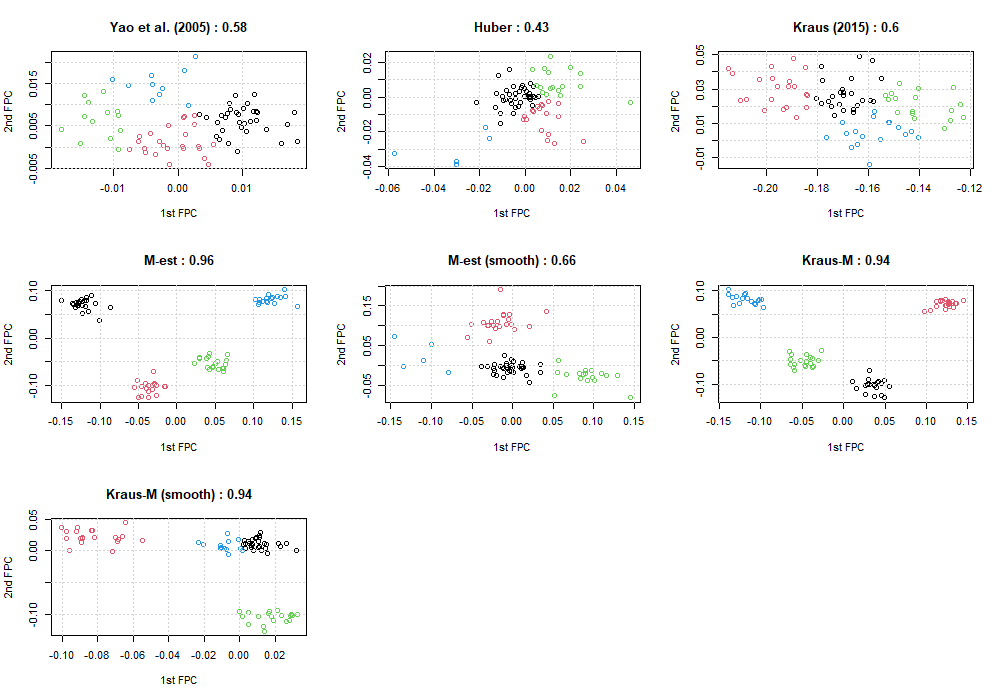
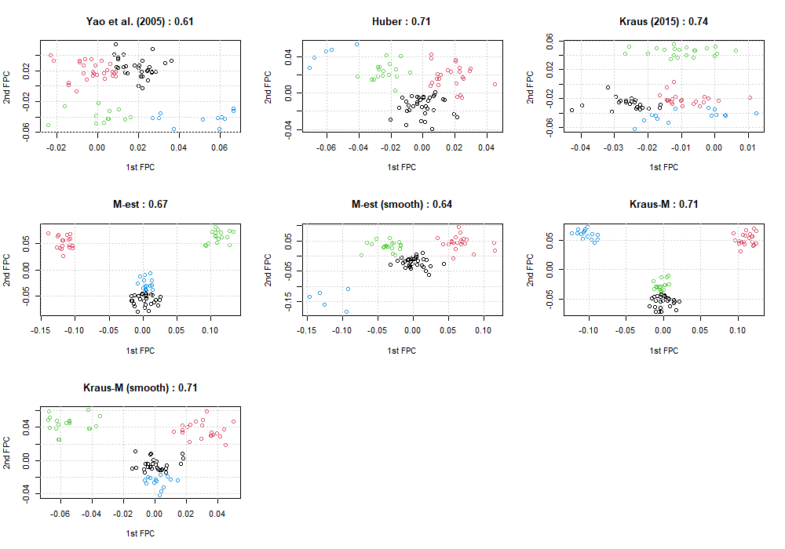

<style>
  p.caption {   <!-- figure caption -->
    font-size: 0.9em;
    font-style: italic;
    color: grey;
    <!-- margin-right: 10%; -->
    <!-- margin-left: 10%;   -->
    text-align: justify;
  }
  caption {    <!-- table caption -->
    font-size: 0.9em;
    font-style: italic;
    color: grey;
    <!-- margin-right: 10%; -->
    <!-- margin-left: 10%;   -->
    text-align: justify;
  }
</style>


```{r setup, include=FALSE}
library(knitr)
library(kableExtra)
library(tidyverse)
knitr::opts_chunk$set(
  echo = FALSE, message = FALSE, warning = FALSE, 
  # cache = T,
  fig.align = "center", fig.width = 12, fig.height = 6
)
# Set working directory
# knitr::opts_knit$set(root.dir = "../")
```


# Simulation

## Settings
- **Completion**
  - Delaigle et al. (2020) setting
  - 20% outlier + partially observed
  - 5 FPC scores
  - 50 repetitions
- **Clustering**
  - shifted Doppler signal setting
    - 4개 true clusters
    - 512 => 128 timepoints로 줄여서 확인
  - 20% outliers + partially observed
  - Huber의 경우, variance가 0이 되는 양끝 부분은 가장 가까운 값으로 대체
  - 2 FPC scores
  - Trimmed $k$-means clustering 적용 (outlier 비율만큼 trim되도록 설정)
  - 50 repetitions
- **비교 방법론**
  - **Yao (2005)** : PCA (CE)
  - **Huber** : Lin & Wang (2020) + Huber loss function + PCA (CE)
  - **M-est** : Marginal M-estimator for mean and covariances + PCA (CE)
  - **M-est (smooth)** : M-est + 2D smoothed covariance + PCA (CE)
  - **Kraus (2015)** : PCA (Kraus)
  - **Kraus-M** : M-est + PCA (Kraus)
  - **Kraus-M (smooth)** : M-est (smooth) + PCA (Kraus)
- pre-smoothing 적용 X


<br>

## Completion result - Delaigle setting

```{r}
df <- data.frame(
  method = c("Yao (2005)","Huber","M-est","M-est (smooth)","Kraus (2015)","Kraus-M","Kraus-M (smooth)"),
  MISE.x = c("0.53 (1.95)","0.05 (0.03)","0.05 (0.04)","0.36 (1.31)","0.03 (0.02)","0.06 (0.03)","0.13 (0.05)"),
  MSE.x = c("2.57 (9.79)","0.28 (0.16)","0.24 (0.17)","1.35 (4.95)","0.25 (0.24)","0.44 (0.28)","1.15 (0.42)"),
  MISE.x1 = c("","","0.03 (0.02)","0.02 (0.01)","","0.06 (0.03)","0.13 (0.05)"),
  MSE.x1 = c("","","0.16 (0.09)","0.09 (0.05)","","0.47 (0.31)","1.2 (0.47)"),
  
  MISE.y = c("0.94 (2.42)","0.06 (0.03)","0.15 (0.21)","0.04 (0.04)","0.37 (0.11)","0.16 (0.06)","0.06 (0.03)"),
  MSE.y = c("7.67 (19.64)","0.34 (0.17)","0.68 (0.83)","0.18 (0.18)","2.64 (0.64)","1.37 (0.46)","0.46 (0.34)"),
  MISE.y1 = c("","","0.05 (0.03)","0.03 (0.02)","","0.19 (0.07)","0.07 (0.03)"),
  MSE.y1 = c("","","0.26 (0.13)","0.15 (0.07)","","1.54 (0.54)","0.62 (0.36)")
)

knitr::kable(df,
             # digits = 3,
             col.names = c("Method","MISE","MSE","MISE","MSE","MISE","MSE","MISE","MSE"),
             align = "c",
             escape = FALSE,
             caption = "Table 1. Average MISE, MSE, and its standard errors of completion for simulated data from 50 repetitions.") %>%
    kable_styling("striped", full_width = FALSE, font_size = 14) %>%
    add_header_above(c(" " = 1,
                       "Noise X (M est)" = 2,
                       "Noise O (M est)" = 2,
                       "Noise X (M est)" = 2,
                       "Noise O (M est)" = 2)) %>% 
    add_header_above(c(" " = 1,
                       "Outlier X" = 4,
                       "Outlier O" = 4))
```


```{r}
df <- data.frame(
  method = c("Yao (2005)","Huber","M-est","M-est (smooth)"),
  MISE.x = c("0.60 (2.11)","0.06 (0.03)","0.07 (0.04)","0.38 (1.32)"),
  MSE.x = c("0.65 (2.31)","0.07 (0.04)","0.07 (0.05)","0.41 (1.47)"),
  MISE.x1 = c("","","0.04 (0.02)","0.03 (0.01)"),
  MSE.x1 = c("","","0.05 (0.02)","0.03 (0.02)"),
  
  MISE.y = c("3.81 (8.24)","0.07 (0.04)","0.21 (0.22)","0.05 (0.04)"),
  MSE.y = c("3.91 (8.35)","0.08 (0.04)","0.22 (0.24)","0.06 (0.05)"),
  MISE.y1 = c("","","0.09 (0.04)","0.04 (0.02)"),
  MSE.y1 = c("","","0.1 (0.04)","0.04 (0.02)")
)

knitr::kable(df,
             # digits = 3,
             col.names = c("Method","MISE","MSE","MISE","MSE","MISE","MSE","MISE","MSE"),
             align = "c",
             escape = FALSE,
             caption = "Table 2. Average MISE, MSE, and its standard errors of reconstruction for simulated data from 50 repetitions.") %>%
    kable_styling("striped", full_width = FALSE, font_size = 14) %>%
    add_header_above(c(" " = 1,
                       "Noise X (M est)" = 2,
                       "Noise O (M est)" = 2,
                       "Noise X (M est)" = 2,
                       "Noise O (M est)" = 2)) %>% 
    add_header_above(c(" " = 1,
                       "Outlier X" = 4,
                       "Outlier O" = 4))
```

```{r, fig.show = 'hold', fig.cap = "Figure 1. Completion for missing parts of 1st simulated data. Top is obtained from raw data, and bottom from pre-smoothed data."}
# knitr::include_graphics(
#   c("../figure/2021_0513/comp.png",
#     "../figure/2021_0513/comp_sm.png")
# )
```

<br>

## Completion result - shifted Doppler signal

```{r}
df <- data.frame(
  method = c("Yao (2005)","Huber","M-est","M-est (smooth)","Kraus (2015)","Kraus-M","Kraus-M (smooth)"),
  MISE.x = c("","","","","","",""),
  MSE.x = c("","","","","","",""),
  MISE.y = c("11.64 (71.67)","0.66 (0.08)","0.19 (0.02)","0.54 (0.06)","3.88 (21.40)","0.42 (0.08)","0.58 (0.07)"),
  MSE.y = c("669.95 (4552.26)","3.67 (0.28)","1.18 (0.08)","3.09 (0.22)","20.94 (110.73)","2.46 (0.35)","3.35 (0.24)")
)

knitr::kable(df,
             # digits = 3,
             col.names = c("Method","MISE","MSE","MISE","MSE"),
             align = "c",
             escape = FALSE,
             caption = "Table 1. 100 x average MISE, MSE, and its standard errors of completion for simulated data from 50 repetitions.") %>%
    kable_styling("striped", full_width = FALSE, font_size = 14) %>%
    add_header_above(c(" " = 1,
                       "Outlier X" = 2,
                       "Outlier O" = 2))
```

```{r}
df <- data.frame(
  method = c("Yao (2005)","Huber","M-est","M-est (smooth)"),
  MISE.x = c("","","",""),
  MSE.x = c("","","",""),
  MISE.y = c("100.87 (657.80)","3.47 (0.12)","1.01 (0.02)","3.14 (0.07)"),
  MSE.y = c("103.28 (674.27)","3.45 (0.12)","1.01 (0.02)","3.12 (0.07)")
)

knitr::kable(df,
             # digits = 3,
             col.names = c("Method","MISE","MSE","MISE","MSE"),
             align = "c",
             escape = FALSE,
             caption = "Table 2. 100 x average MISE, MSE, and its standard errors of reconstruction for simulated data from 50 repetitions.") %>%
    kable_styling("striped", full_width = FALSE, font_size = 14) %>%
    add_header_above(c(" " = 1,
                       "Outlier X" = 2,
                       "Outlier O" = 2))
```


<br>

## Clustering result

```{r}
df <- data.frame(
  method = c("Yao (2005)","Huber","M-est","M-est (smooth)","Kraus (2015)","Kraus-M","Kraus-M (smooth)"),
  CCR = c("0.77 (0.02)","0.39 (0.06)","0.99 (0.02)","0.66 (0.12)","1.00 (0.01)","0.99 (0.04)","0.78 (0.04)"),
  aRand = c("0.65 (0.03)","0.05 (0.07)","0.98 (0.05)","0.50 (0.17)","1.00 (0.03)","0.99 (0.05)","0.66 (0.03)"),
  CCR_out = c("0.64 (0.11)","0.52 (0.06)","0.95 (0.02)","0.64 (0.04)","0.61 (0.12)","0.97 (0.02)","0.79 (0.03)"),
  aRand_out = c("0.38 (0.15)","0.24 (0.08)","0.89 (0.06)","0.41 (0.07)","0.35 (0.14)","0.92 (0.05)","0.65 (0.05)")
)

knitr::kable(df,
             # digits = 3,
             col.names = c("Method","CCR","aRand","CCR","aRand"),
             align = "c",
             escape = FALSE,
             caption = "Table 3. Average CCR (Correct classification rate), average aRand (Adjusted Rand index), and its standard errors from Trimmed $k$-means clustering using 2 FPCs from 50 repetitions.") %>%
    kable_styling("striped", full_width = FALSE, font_size = 14) %>%
    add_header_above(c(" " = 1,
                       "Outlier X" = 2,
                       "Outlier O" = 2))
```

```{r, fig.cap = "Figure 2. Scatter plot between 1st and 2nd FPC scores, and its CCR from 1st simulated data. Each cluster is assigned by the trimmed $k$-means clustering algorithm, and trimmed points are excluded from the plot."}
# 
```

```{r, fig.cap = "Figure 3. Scatter plot between 1st and 2nd FPC scores, and its CCR from 1st simulated data after pre-smoothing is performed. Each cluster is assigned by the trimmed $k$-means clustering algorithm, and trimmed points are excluded from the plot."}
# 
```


```{r}
# clustering after completion
# [1,] "1.00 (0.01)" "1.00 (0.00)" "1.00 (0.00)" "0.77 (0.14)" "0.99 (0.09)" "1.00 (0.00)" "1.00 (0.00)"
# [2,] "0.99 (0.03)" "1.00 (0.00)" "1.00 (0.00)" "0.65 (0.19)" "0.98 (0.13)" "1.00 (0.00)" "1.00 (0.00)"
```

