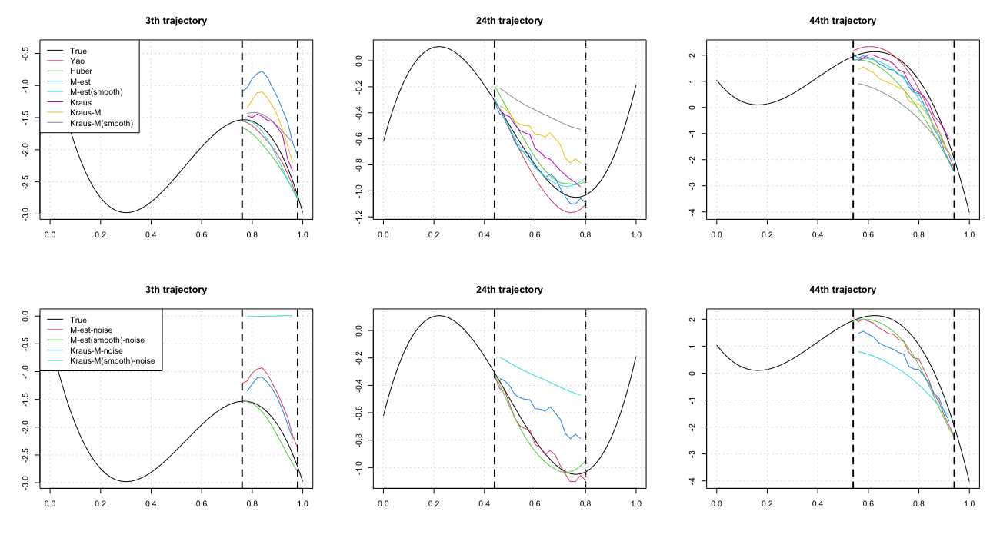
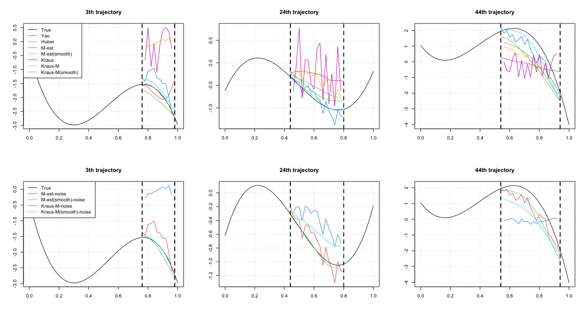
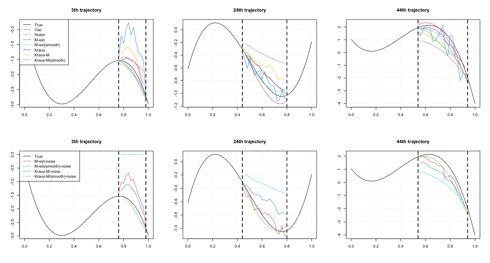
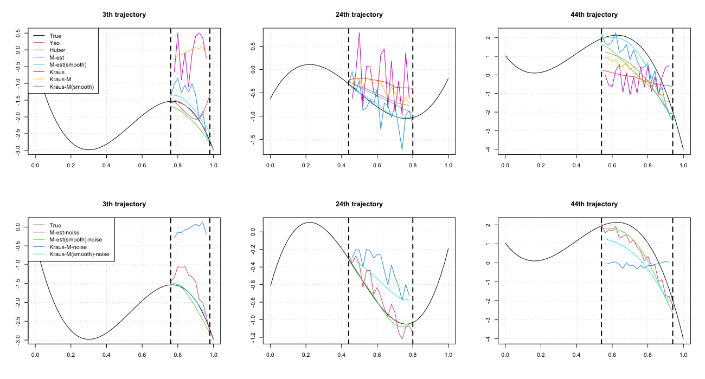
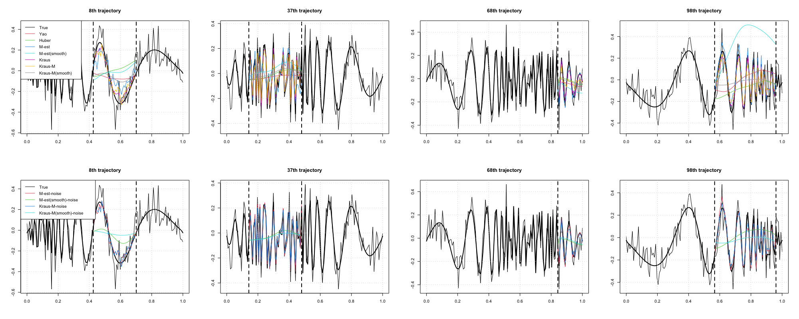
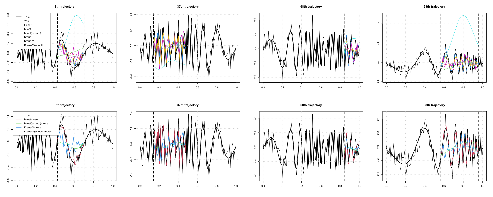
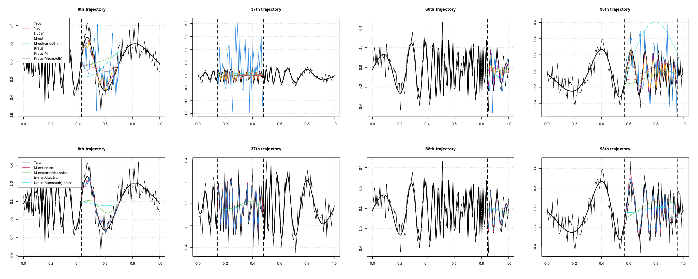
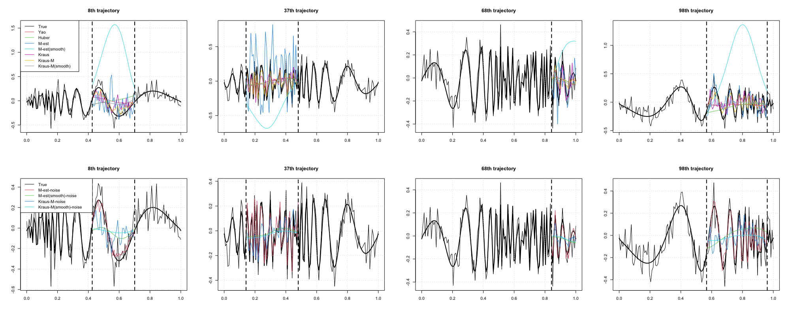

<style>
  p.caption {   <!-- figure caption -->
    font-size: 0.9em;
    font-style: italic;
    color: grey;
    <!-- margin-right: 10%; -->
    <!-- margin-left: 10%;   -->
    text-align: justify;
  }
  caption {    <!-- table caption -->
    font-size: 0.9em;
    font-style: italic;
    color: grey;
    <!-- margin-right: 10%; -->
    <!-- margin-left: 10%;   -->
    text-align: justify;
  }
</style>


```{r setup, include=FALSE}
library(knitr)
library(kableExtra)
library(tidyverse)
knitr::opts_chunk$set(
  echo = FALSE, message = FALSE, warning = FALSE, 
  # cache = T,
  fig.align = "center", fig.width = 12, fig.height = 6
)
# Set working directory
# knitr::opts_knit$set(root.dir = "../")
```


# Completion - Delaigle setting

- Delaigle et al. (2020) setting
- 20% outlier + partially observed
- Fixed hyperparameters (bandwidth, delta in Huber function)
- 50 repetitions
- pre-smoothing X
- PC 개수에 따라 2가지 경우를 고려
  - 5 FPCs
  - PVE = 0.99
- M-est 기반 방법(M-est, Kraus-M 등)에서 noise variance를 가정한 경우도 요약
  - 결과적으로, noise var을 빼주더라도 completion이 더 smooth한 경향은 보이지 않음
    - Yao, Huber는 raw 데이터를 smoothing하지 않는 대신 covariance를 smoothing하여 결과적으로 completion이 smooth한 형태로 나오게 됨
    - 반면, Kraus 방법은 pre-smoothing을 하지 않으면 중간에 smoothing 과정이 없어 다소 wiggly한 형태를 보이게 되는 것으로 보임
- Kraus는 PC score로 completion을 하지 않고, 따로 parameter estimation을 통해 completion 진행
  - 따라서, PC 개수 및 PVE는 정리하지 않음
  - K와 PVE에 depend하지 않기 때문에, Kraus 방법으로 적용한 경우는 두 표의 값이 같음

## 5 FPCs

```{r}
df <- data.frame(
  method = c("Yao (2005)","Huber","M-est","M-est (smooth)","Kraus (2015)","Kraus-M","Kraus-M (smooth)"),
  pve.x = c("1.00","0.87","0.96","1.00","","",""),
  MISE.x = c("0.53 (1.95)","0.05 (0.03)","0.05 (0.04)","0.36 (1.31)","0.03 (0.02)","0.06 (0.03)","0.13 (0.05)"),
  MSE.x = c("2.57 (9.79)","0.28 (0.16)","0.24 (0.17)","1.35 (4.95)","0.25 (0.24)","0.44 (0.28)","1.15 (0.42)"),
  pve.x1 = c("","","0.97","1.00","","",""),
  MISE.x1 = c("","","0.03 (0.02)","0.02 (0.01)","","0.06 (0.03)","0.13 (0.05)"),
  MSE.x1 = c("","","0.16 (0.09)","0.09 (0.05)","","0.47 (0.31)","1.2 (0.47)"),
  
  pve.y = c("1.00","0.87","0.72","1.00","","",""),
  MISE.y = c("0.94 (2.42)","0.06 (0.03)","0.15 (0.21)","0.04 (0.04)","0.37 (0.11)","0.16 (0.06)","0.06 (0.03)"),
  MSE.y = c("7.67 (19.64)","0.34 (0.17)","0.68 (0.83)","0.18 (0.18)","2.64 (0.64)","1.37 (0.46)","0.46 (0.34)"),
  pve.y = c("","","0.75","1.00","","",""),
  MISE.y1 = c("","","0.05 (0.03)","0.03 (0.02)","","0.19 (0.07)","0.07 (0.03)"),
  MSE.y1 = c("","","0.26 (0.13)","0.15 (0.07)","","1.54 (0.54)","0.62 (0.36)")
)

knitr::kable(df,
             # digits = 3,
             col.names = c("Method","PVE","MISE","MSE","PVE","MISE","MSE","PVE","MISE","MSE","PVE","MISE","MSE"),
             align = "c",
             escape = FALSE,
             caption = "Table 1. Average MISE, MSE, and its standard errors of completion for simulated data from 50 repetitions.") %>%
    kable_styling("striped", full_width = FALSE, font_size = 14) %>%
    add_header_above(c(" " = 1,
                       "Noise X (M est)" = 3,
                       "Noise O (M est)" = 3,
                       "Noise X (M est)" = 3,
                       "Noise O (M est)" = 3)) %>% 
    add_header_above(c(" " = 1,
                       "Outlier X" = 6,
                       "Outlier O" = 6))
```

- 시뮬레이션 세팅이 Matern correlation 형태를 가정하였기 때문에, 이를 사용하여 cov를 estimate하는 Huber가 가장 낮은 error를 보여줌
- Outlier가 있는 경우, M-est의 PVE가 급격히 낮아짐
- Conditional expectation으로 PCA를 하는 경우에는 noise var을 빼주었을 때, error가 작아졌지만, Kraus의 경우는 오히려 높아지는 경향이 있음.
  - 이는 doppler에서도 마찬가지...


<br>

## PVE = 0.99

```{r}
df <- data.frame(
  method = c("Yao (2005)","Huber","M-est","M-est (smooth)","Kraus (2015)","Kraus-M","Kraus-M (smooth)"),
  pve.x = c("4.00","25.32","12.76","4.22","","",""),
  MISE.x = c("0.50 (1.91)","0.05 (0.03)","0.06 (0.05)","0.34 (1.26)","0.03 (0.02)","0.06 (0.03)","0.13 (0.05)"),
  MSE.x = c("2.45 (9.62)","0.30 (0.19)","0.29 (0.19)","1.28 (4.66)","0.25 (0.24)","0.44 (0.28)","1.15 (0.42)"),
  pve.x1 = c("","","11.84","4.22","","",""),
  MISE.x1 = c("","","0.03 (0.02)","0.02 (0.01)","","0.06 (0.03)","0.13 (0.05)"),
  MSE.x1 = c("","","0.18 (0.1)","0.1 (0.05)","","0.47 (0.31)","1.2 (0.47)"),
  
  pve.y = c("3.78","25.30","27.94","4.64","","",""),
  MISE.y = c("0.94 (2.4)","0.06 (0.03)","0.26 (0.26)","0.04 (0.04)","0.37 (0.11)","0.16 (0.06)","0.06 (0.03)"),
  MSE.y = c("7.61 (19.42)","0.37 (0.19)","1.12 (1.06)","0.17 (0.17)","2.64 (0.64)","1.37 (0.46)","0.46 (0.34)"),
  pve.y = c("","","22.78","4.40","","",""),
  MISE.y1 = c("","","0.04 (0.02)","0.03 (0.02)","","0.19 (0.07)","0.07 (0.03)"),
  MSE.y1 = c("","","0.23 (0.11)","0.15 (0.07)","","1.54 (0.54)","0.62 (0.36)")
)

knitr::kable(df,
             # digits = 3,
             col.names = c("Method","K","MISE","MSE","K","MISE","MSE","K","MISE","MSE","K","MISE","MSE"),
             align = "c",
             escape = FALSE,
             caption = "Table 2. Average MISE, MSE, and its standard errors of completion for simulated data from 50 repetitions.") %>%
    kable_styling("striped", full_width = FALSE, font_size = 14) %>%
    add_header_above(c(" " = 1,
                       "Noise X (M est)" = 3,
                       "Noise O (M est)" = 3,
                       "Noise X (M est)" = 3,
                       "Noise O (M est)" = 3)) %>% 
    add_header_above(c(" " = 1,
                       "Outlier X" = 6,
                       "Outlier O" = 6))
```

- PVE = 0.99가 되는 PC 개수가 Huber와 M-est에서 매우 크게 나타남.
  - 다소 높게 잡긴 했지만, 그럼에도 Yao와 M-est(smooth)는 적은 PC 개수로도 0.99를 넘음
  - PVE=0.9까지는 2~3개 정도면 충분하지만, 이후 eigenvalue 값들의 차이가 작아서 PVE 상승폭이 작음


<br>

## K=5, Outlier X

```{r, fig.cap = "Figure 1. Completion for missing parts of 50th simulated data."}

```

## K=5, Outlier O

```{r, fig.cap = "Figure 2. Completion for missing parts of 50th simulated data."}

```

## PVE=0.99, Outlier X

```{r, fig.cap = "Figure 3. Completion for missing parts of 50th simulated data."}

```

## PVE=0.99, Outlier O

```{r, fig.cap = "Figure 4. Completion for missing parts of 50th simulated data."}

```

<br>

# Completion - shifted Doppler signal

- shifted Doppler signal setting
  - 512 => 128 timepoints로 줄여서 확인
  - Delaigle 세팅과 달리 wiggly한 curve로 이루어짐
- 20% outliers + partially observed
- Fixed hyperparameters (bandwidth, delta in Huber function)
- Huber의 경우, variance가 0이 되는 양끝 부분은 가장 가까운 값으로 대체
- 50 repetitions
- pre-smoothing X
- PC 개수에 따라 2가지 경우를 고려
  - 5 FPCs
  - PVE = 0.99
- Kraus는 PCA 결과를 사용하지 않고, 이와 개별적으로 completion 진행
  - 따라서, PC 개수 및 PVE는 정리하지 않음

## 5 FPCs

```{r}
df <- data.frame(
  method = c("Yao (2005)","Huber","M-est","M-est (smooth)","Kraus (2015)","Kraus-M","Kraus-M (smooth)"),
  pve.x = c("1.00","0.89","0.75","0.99","","",""),
  MISE.x = c("0.57 (0.06)","0.66 (0.07)","0.23 (0.03)","5.84 (6.89)","0.21 (0.02)","0.23 (0.03)","0.56 (0.06)"),
  MSE.x = c("3.24 (0.21)","3.68 (0.24)","1.29 (0.08)","22.27 (24.69)","1.29 (0.09)","1.44 (0.11)","3.18 (0.22)"),
  pve.x = c("","","0.95","1.00","","",""),
  MISE.x1 = c("","","0.18 (0.02)","0.54 (0.06)","","0.21 (0.02)","0.60 (0.06)"),
  MSE.x1 = c("","","1.13 (0.06)","3.07 (0.20)","","1.38 (0.13)","3.41 (0.21)"),
  
  pve.y = c("1.00","0.86","0.56","0.97","","",""),
  MISE.y = c("11.64 (71.67)","0.66 (0.08)","0.22 (0.03)","11.91 (8.20)","3.88 (21.40)","0.30 (0.05)","0.56 (0.07)"),
  MSE.y = c("669.95 (4552.26)","3.67 (0.28)","1.29 (0.09)","46.25 (31.31)","20.94 (110.73)","1.87 (0.18)","3.25 (0.21)"),
  pve.y1 = c("","","0.71","1.00","","",""),
  MISE.y1 = c("","","0.19 (0.02)","0.54 (0.06)","","0.42 (0.08)","0.58 (0.07)"),
  MSE.y1 = c("","","1.18 (0.08)","3.09 (0.22)","","2.46 (0.35)","3.35 (0.24)")
)

knitr::kable(df,
             # digits = 3,
             col.names = c("Method","PVE","MISE","MSE","PVE","MISE","MSE","PVE","MISE","MSE","PVE","MISE","MSE"),
             align = "c",
             escape = FALSE,
             caption = "Table 3. 100 x average MISE, MSE, and its standard errors of completion for simulated data from 50 repetitions.") %>%
    kable_styling("striped", full_width = FALSE, font_size = 14) %>%
    add_header_above(c(" " = 1,
                       "Noise X (M est)" = 3,
                       "Noise O (M est)" = 3,
                       "Noise X (M est)" = 3,
                       "Noise O (M est)" = 3)) %>% 
    add_header_above(c(" " = 1,
                       "Outlier X" = 6,
                       "Outlier O" = 6))
```

- Figure 5을 보았을 때, 중간 단계에서 smoothing을 하는 방법론들은 wiggly한 패턴을 잘 따라가지 못하는 것으로 보임
  - Huber, M-est(smooth), Kraus-M(smooth)
- M-est는 outlier가 있을 때, 5개의 PC만으로도 가장 낮은 error를 보여주지만, PVE가 너무 작음
  - 특히, 이 세팅에서 PC 개수에 따른 PVE 상승률이 매우 작음 (예를 들어, PVE가 0.24, 0.41, 0.58, 0.74, ...과 first K개 PC의 PVE가 매우 작음)
- M-est, M-est(smooth)는 noise 보정을 하였을 떄, 다소 error가 작아지지만, Kraus-M과 Kraus-M(smooth)는 오히려 error가 커짐

<br>

## PVE = 0.99

```{r}
df <- data.frame(
  method = c("Yao (2005)","Huber","M-est","M-est (smooth)","Kraus (2015)","Kraus-M","Kraus-M (smooth)"),
  pve.x = c("4.00","31.88","66.10","5.34","","",""),
  MISE.x = c("0.57 (0.06)","0.67 (0.07)","1.18 (0.32)","6.22 (7.35)","0.21 (0.02)","0.23 (0.03)","0.56 (0.06)"),
  MSE.x = c("3.24 (0.21)","3.72 (0.25)","5.18 (0.97)","23.66 (26.36)","1.29 (0.09)","1.44 (0.11)","3.18 (0.22)"),
  pve.x1 = c("","","15.14","4.00","","",""),
  MISE.x1 = c("","","0.19 (0.02)","0.54 (0.06)","","0.21 (0.02)","0.60 (0.06)"),
  MSE.x1 = c("","","1.18 (0.07)","3.07 (0.20)","","1.38 (0.13)","3.41 (0.21)"),
  
  pve.y = c("2.47","38.00","68.04","6.81","","",""),
  MISE.y = c("11.35 (69.68)","0.67 (0.08)","1.19 (0.37)","16.82 (10.62)","3.88 (21.40)","0.30 (0.05)","0.56 (0.07)"),
  MSE.y = c("651.55 (4426.26)","3.70 (0.28)","5.26 (1.14)","65.90 (40.85)","20.94 (110.73)","1.87 (0.18)","3.25 (0.21)"),
  pve.y = c("","","25.45","4.15","","",""),
  MISE.y1 = c("","","0.21 (0.02)","0.54 (0.06)","","0.42 (0.08)","0.58 (0.07)"),
  MSE.y1 = c("","","1.27 (0.09)","3.09 (0.22)","","2.46 (0.35)","3.35 (0.24)")
)

knitr::kable(df,
             # digits = 3,
             col.names = c("Method","K","MISE","MSE","K","MISE","MSE","K","MISE","MSE","K","MISE","MSE"),
             align = "c",
             escape = FALSE,
             caption = "Table 4. 100 x average MISE, MSE, and its standard errors of completion for simulated data from 50 repetitions.") %>%
    kable_styling("striped", full_width = FALSE, font_size = 14) %>%
    add_header_above(c(" " = 1,
                       "Noise X (M est)" = 3,
                       "Noise O (M est)" = 3,
                       "Noise X (M est)" = 3,
                       "Noise O (M est)" = 3)) %>% 
    add_header_above(c(" " = 1,
                       "Outlier X" = 6,
                       "Outlier O" = 6))
```

- Delaigle 세팅과 비슷하게 Huber와 M-est는 PVE=0.99를 맞추기 위해 매우 많은 PC 개수가 필요
- 그럼에도 값의 차이는 5개 PC를 사용했을 때와 크게 다르지 않음

<br>

## K=5, Outlier X

```{r, fig.cap = "Figure 5. Completion for missing parts of 50th simulated data."}

```

## K=5, Outlier O

```{r, fig.cap = "Figure 6. Completion for missing parts of 50th simulated data."}

```

## PVE=0.99, Outlier X

```{r, fig.cap = "Figure 7. Completion for missing parts of 50th simulated data."}

```

## PVE=0.99, Outlier O

```{r, fig.cap = "Figure 8. Completion for missing parts of 50th simulated data."}

```