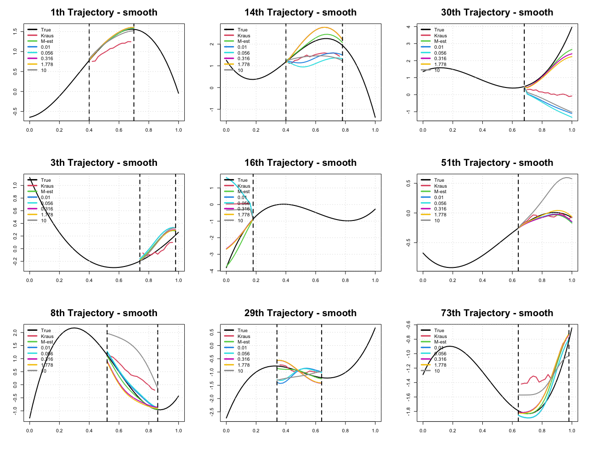

<style>
  p.caption {   <!-- figure caption -->
    font-size: 0.9em;
    font-style: italic;
    color: grey;
    <!-- margin-right: 10%; -->
    <!-- margin-left: 10%;   -->
    text-align: justify;
  }
  caption {    <!-- table caption -->
    font-size: 0.9em;
    font-style: italic;
    color: grey;
    <!-- margin-right: 10%; -->
    <!-- margin-left: 10%;   -->
    text-align: justify;
  }
</style>


```{r setup, include=FALSE}
library(knitr)
library(kableExtra)
library(tidyverse)
knitr::opts_chunk$set(
  echo = FALSE, message = FALSE, warning = FALSE, 
  # cache = T,
  fig.align = "center", fig.width = 12, fig.height = 6
)
# Set working directory
# knitr::opts_knit$set(root.dir = "../")
```


# Covariance estimation from Lounici (2014) 
> Lounici, K. (2014). High-dimensional covariance matrix estimation with missing observations. Bernoulli, 20(3), 1029-1058.

$$ \tilde{\Sigma}_n = (\delta^{-1} - \delta^{-2})\text{diag}(\Sigma_n^{(\delta)}) + \delta^{-2}\Sigma_n^{(\delta)}, \tag{1.4}$$
$$ \hat{\Sigma}^{\lambda} = \underset{S \in \mathcal{S}_p}{\arg\min} \lVert \tilde{\Sigma}_n - S \rVert_2^2 + \lambda \lVert S \rVert_1 \tag{1.5}, $$
where $\lVert A \rVert_2$ is the Frobenius norm and $\lVert A \rVert_1$ is the nuclear norm.

- (1.5) 식은 **Singular Value Thresholding (SVT) algorithm**로 optimize. ([*filling*](https://cran.r-project.org/web/packages/filling/filling.pdf) 패키지의 `fill.SVT()`)

  > Cai, J. F., Candès, E. J., & Shen, Z. (2010). [A singular value thresholding algorithm for matrix completion. SIAM Journal on optimization](https://authors.library.caltech.edu/18606/1/Cai2010p10180Siam_J_Optimiz.pdf), 20(4), 1956-1982.

- $\delta$는 known이라 가정하고 이론이 전개되었으나, simulation에서는 다음과 같이 empirical한 값을 사용
$$ \hat\delta = \frac{\sum_{i=1}^p\sum_{j=1}^p \mathbf{1}_{ \{Y(t_{ij}) \text{ is observed} \} } }{p^2},$$ 
wherer $p$ is the dimension of covariance.

- Lounici (2014) paper의 식 (3.8)에서 regularization parameter $\lambda$를 선택하는 방법이 소개되어 있으나, 이는 constant $C$에 depend하며 그냥 충분히 큰 상수라고만 언급되어있음....
$$ \lambda = C \frac{\sqrt{\text{tr}(\tilde\Sigma_n) \lVert \tilde\Sigma_n \rVert_\infty }}{\delta} \sqrt{\frac{\log(2p)}{n}}, \tag{3.8} $$
where $C>0$ is a large enough constant.


<br>

# Non-contaminated case
- Setting은 이전부터 계속 해왔던 Delaigle (2020) setting을 활용
- 여기서 *M-est*는 *M-est(smooth)*를 의미 (covariance에 bivariate smoothing까지 고려한 경우)
- regularization parameter $\lambda$에 따른 completion 형태를 확인
- 2가지 경우 고려
  1. Lounici (2014)
  2. (1.4)에서 $\Sigma_n^{(\delta)}$을 M-est로 바꾼 경우


## Covariance surfaces
### 1. Lounici (2014)
```{r}

```

### 2. (1.4)에서 M-est로 바꾼 경우
```{r}

```


## Completion
### 1. Lounici (2014)
```{r}
knitr::include_graphics("../figure/2021_0624/out_X_sm_kraus.png")
```

### 2. (1.4)에서 M-est로 바꾼 경우
```{r}

```


<br>

# Contaminated case
- 이전 세팅과 동일하나, 1번은 생략하고 2번(M-est로 바꾼 경우)만 고려

## Covariance surfaces
### 1. Lounici (2014)
```{r}

```

### 2. (1.4)에서 M-est로 바꾼 경우
```{r}

```

## Completion
### 1. Lounici (2014)
```{r}

```

### 2. (1.4)에서 M-est로 바꾼 경우
```{r}

```


