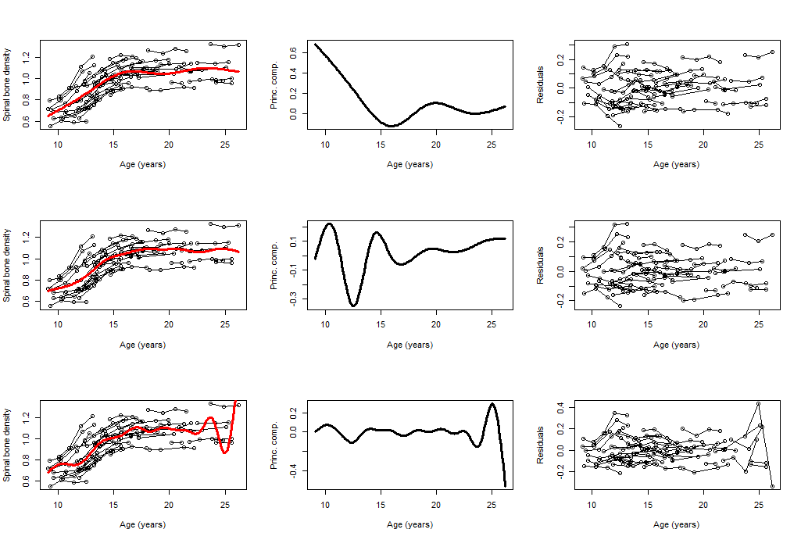
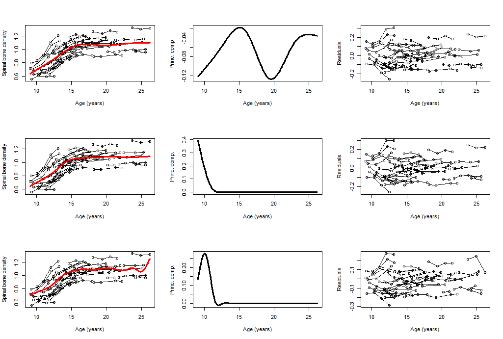
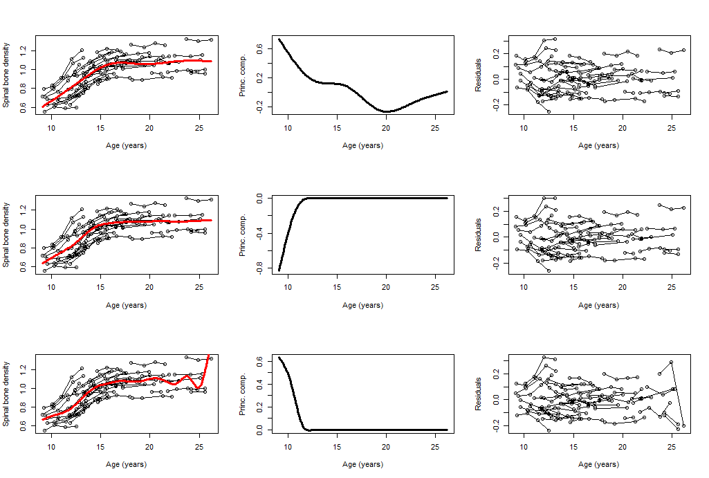

# Principal component models for sparse functional data

## 1. Bone Mineral Density data ([dataset](https://web.stanford.edu/~hastie/ElemStatLearn/data.html))

- 원데이터
  - 1,003 observations
  - Variables : idnum(피측정자), ehnic(인종), age(관측 시점), sex(성별), spnbmd(bone mineral density)
  - ethnic, sex별로 데이터 존재
- 논문에서 사용된 데이터
  - 원데이터에서 (sex=="fem") & (ethnic=="White") & (# obs for each curve $\ge 2$) 경우로 필터링
  - 48명의 백인 여성의 bone mineral density data
  - 160 observations
  - Variables : idnum(피측정자), age(관측 시점), spnbmd(bone mineral density)

## 2. Simulation

- Functional PC를 계산하기 위해 2가지 방법을 고려
  - Mixed effects model
  - Reduced rank model
- 3가지 다른 수의 knots ($4, 9, 14$)를 고려한 natural cubic spline 사용
- EM algorithm을 사용하여 model fitting ([Algorithm](../reference/algorithm.pdf))

### 2-1. Mixed effects model

$$
\mathbf{Y}_i = \mathbf{B}_i\mathbf{\theta}_\mu+\mathbf{B}_i\mathbf{\Theta}^*\mathbf{\alpha_i}^* + \mathbf{\epsilon}_i\\
\text{where }\mathbf{\theta}_\mu \text{ is } q \times 1 \text{ vector, }\mathbf{\Theta}^* \text{ is } q \times q \text{ matrix, } \mathbf{\alpha_i}^* \text{ is } q \times 1 \text{ vector,}\\
 \mathbf{\epsilon}_i \sim (\mathbf{0},\sigma^2\mathbf{I}), \ \mathbf{\alpha}_i \sim (\mathbf{0}, \mathbf{D})
$$
$\text{subject to}$
$$
\mathbf{\Theta}^T\mathbf{\Theta}=\mathbf{I}, \ \int \mathbf{b}(t)^T\mathbf{b}(t)dt=1, \ \int\int \mathbf{b}(t)^T\mathbf{b}(s)dt=0
$$

- $100$ EM iteration
- Initial value = 0.1 ($\sigma^2, \mathbf{D}, \mathbf{\alpha}_i, \mathbf{\theta}_\mu, \mathbf{\Theta}$)

- $\mathbf{B}^T\mathbf{B}=\mathbf{I}$

- $\mathbf{B}^T\mathbf{B}  \ne  \mathbf{I}$

### 2-2. Reduced rank model

$$
\mathbf{Y}_i = \mathbf{B}_i\mathbf{\theta}_\mu+\mathbf{B}_i\mathbf{\Theta}\mathbf{\alpha_i} + \mathbf{\epsilon}_i\\
\text{where }\mathbf{\theta}_\mu^* \text{ is } q \times 1 \text{ vector and }\mathbf{\Theta}^* \text{ is } q \times k \text{ matrix, } \mathbf{\alpha_i} \text{ is } k \times 1 \text{ vector,}\\
 \mathbf{\epsilon}_i \sim (\mathbf{0},\sigma^2\mathbf{I}), \ \mathbf{\alpha}_i \sim (\mathbf{0}, \mathbf{D})
$$

$\text{subject to}$
$$
\mathbf{\Theta}^T\mathbf{\Theta}=\mathbf{I}, \ \int \mathbf{b}(t)^T\mathbf{b}(t)dt=1, \ \int\int \mathbf{b}(t)^T\mathbf{b}(s)dt=0
$$

- $2$개 $PC$ 사용 ($k=2$인 경우)
- $100$ EM iteration
- Initial value $ = 0.1$ ($\sigma^2, \mathbf{D}, \mathbf{\alpha}_i, \mathbf{\theta}_\mu, \mathbf{\Theta}$)

- $\mathbf{B}^T\mathbf{B}=\mathbf{I}$

- $\mathbf{B}^T\mathbf{B} \ne  \mathbf{I}$

## 3. Conclusion

- 연산속도 (단위: 초)

|                                         | Mixed effects model | Reduced rank model |
| :-------------------------------------: | :-----------------: | :----------------: |
|   $\mathbf{B}^T\mathbf{B}=\mathbf{I}$   |       $53.70$       |      $10.83$       |
| $\mathbf{B}^T\mathbf{B} \ne \mathbf{I}$ |       $54.39$       |      $11.14$       |

- 초기값에 따라 EM algorithm의 수렴값이 달라짐
- Reduced rank model의 경우, $\mathbf{\Theta}, \mathbf{\alpha}_i$가 EM algorithm이 제대로 수렴하지 않음
  - $\mathbf{\Theta}_{q \times 2} \rightarrow (\infty, \infty)$
  - $\mathbf{\alpha}_i \rightarrow \mathbf{0}$